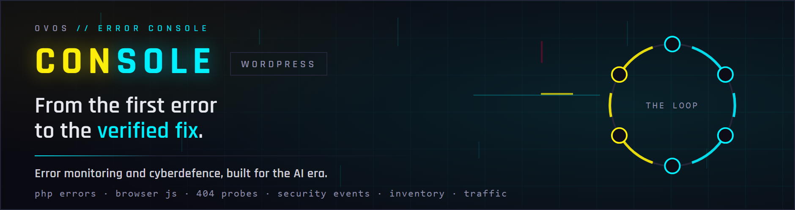
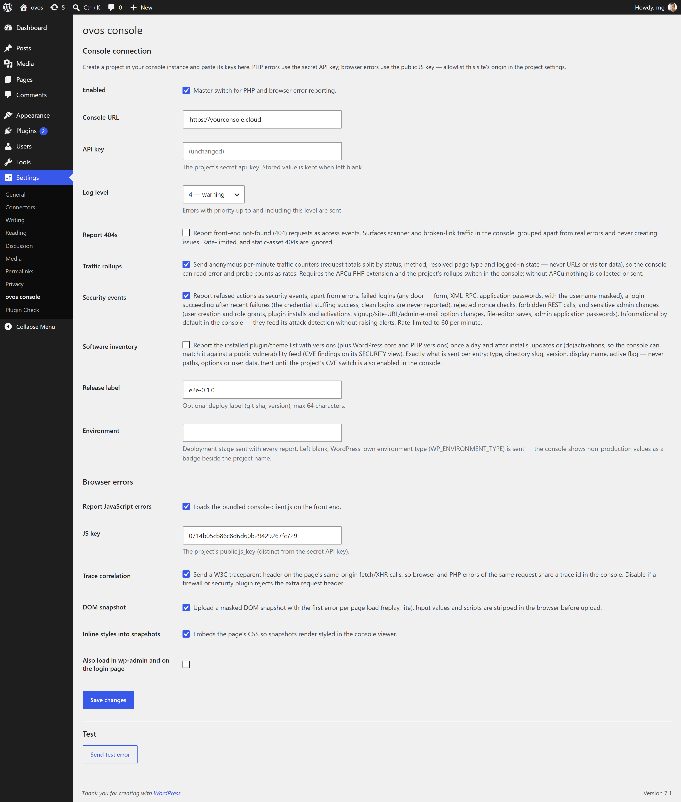

<p align="center">
	
</p>

# ovos console — error monitoring and cyberdefence for WordPress

**Error monitoring and cyberdefence, built for the AI era.** This plugin sends a WordPress site's PHP errors, JavaScript errors, failed logins and scanner probes to the [ovos console](https://ovos.github.io/console/), which ranks what broke, proposes the fix, and reads the attacks on your site as a map of your weak spots. You get **your own console instance** — run for you by ovos, or set up on your own infrastructure for larger organisations.

**This plugin is the client, and it is free** — GPL-2.0, no account needed to read the code, no telemetry of its own. It talks to a console instance; [talk to us](#talk-to-us) about getting one.

**Your site is probed every day, and that half of the traffic is worth reading.** Roughly 45–50% of what a public WordPress site reports on our own instances is not a bug: it is `/wp-login.php`, `/wp-includes/ID3/file.php` and a long tail of random filenames hunting for someone else's backdoor. Old scanners walked a list. AI-driven ones read your answers, and they find holes that sat quiet for years. So the console does not file probes away as noise. It counts them apart from real errors, folds them into **attack waves** by the address behind them, matches your installed plugins against a public vulnerability feed — "vulnerable **and** being probed" is a thing you can see rather than guess — and can replay the request against your site to check whether the door is still open.

What the plugin reports:

- **PHP errors** — warnings, notices and fatals (uncaught exceptions included), batched into a single POST from the shutdown handler after the response went out. Fire-and-forget: every failure is swallowed, the HTTP call has a hard 1 s timeout — reporting can never break or noticeably slow the site.
- **JavaScript errors** — the bundled browser client captures window errors, unhandled rejections and failed fetch/XHR calls, with breadcrumbs and an optional masked DOM snapshot (replay-lite). Reports carry automation evidence, zero-config: a `webdriver` admission (headless browsers, AI agents) and the external scripts the visitor never even attempted to load — the signature of bots that run inline JS without loading script files. The console indexes both as `flags`, so bot-caused issues facet and filter apart from real-user ones.
- **Context** — request variables (redacted before sending), logged-in user id, WordPress version, active theme, and source attribution: each error is tagged with the component its file belongs to — a plugin, a mu-plugin, a theme, a drop-in, WordPress core — or with nobody, when the file is under `uploads` or standing in the site and shipped by no one.
- **Traffic rollups (opt-in)** — anonymous per-minute request counters, so the console can read error and scanner-probe counts as *rates* against real traffic instead of raw numbers — and, since 0.5.1, request-duration histograms beside them, so the console's PERFORMANCE panel answers "did the update make the site slow?" with ≈p50/≈p95 trends and the slowest pages. Never URLs, IPs, visitor data or raw timings — see [Traffic rollups](#traffic-rollups) below. Requires the APCu PHP extension.
- **Security events (opt-in)** — what WordPress *refused*, beside what broke: failed logins, rejected nonce checks, forbidden REST calls, and sensitive admin changes. Usernames masked, rate-limited — see [Security events](#security-events) below.
- **Software inventory (opt-in)** — the installed plugin/theme list with versions, reported once a day and after installs, updates or (de)activations, so the console can match it against a public vulnerability feed and show CVE findings — including "vulnerable AND being probed" — on its SECURITY view. Per entry: type, slug, version, display name, active flag; never paths, options or user data. See [Software inventory](#software-inventory) below.
- **Integrity scan (opt-in background pass, plus a Scan now button)** — a read-only walk of the site's files for what nobody shipped: PHP under uploads, media files that open with a PHP tag, PHP in the document root WordPress did not ship, hidden PHP, `.htaccess`/`.user.ini` directives that make other files execute or redirect visitors, drop-ins and plugin data directories without their plugin — plus the hardening posture. Paths, sizes and dates only, never content; nothing is ever changed. Results show on the settings page and go to the console's SECURITY view. See [Integrity scan](#integrity-scan) below.

## The console

<p align="center">
	<a href="https://console-demo.ovos.at/"></a>
</p>

**[Try the live demo →](https://console-demo.ovos.at/)** — a public instance filled with synthetic errors. No login, no sign-up: browse the grid, expand a row for the full backtrace and request context, filter the issues, look at the monitors. Changes are disabled, triage (check, star, resolve) is not — press <kbd>?</kbd> for the keyboard map.

One console for everything you run:

- **Live** — errors from PHP, browser JavaScript, WordPress, Node.js and OpenTelemetry services land the moment they happen; an error storm is ingested through Redis Streams without slowing the app that reported it.
- **Issues, not noise** — the same error a thousand times is one row with a count, fingerprinted into an issue with an open → resolved → regressed lifecycle.
- **Trace correlation** — a failed browser request and the PHP error behind it share one trace id, so a broken request lines up across services in a click.
- **Uptime** — dead-man's-switch heartbeats for cron jobs and health-URL probes, so you hear about the job that stopped running before your users do.
- **Alerting** — priority-gated, throttled email and chat notifications, per project.
- **Ask your AI** — point Claude or any MCP client at the console and ask about your errors, or hit `◇ AI EXPLAIN` on any row for a plain-English root-cause read.

Your own instance, not a shared tenancy — run for you by ovos in Vienna, or set up on your own infrastructure when the data has to stay there. More on the [product page](https://ovos.github.io/console/), or [write to us](#talk-to-us).

## In WordPress

One settings screen under **Settings → ovos console**, and nothing else: no dashboard widget, no menu entry, no database tables, no cron of its own.

<p align="center">
	
</p>

Every switch is off until you turn it on, and each one says exactly what it sends. Anything you would rather set in code — the URL, the keys, the log level — can come from `wp-config.php` constants instead, in which case the field shows as locked.

## Requirements

- WordPress 6.0+
- PHP 8.1+ (the `Requires PHP` header prevents activation on older hosts)
- an ovos console instance reachable from this site

## Installation

The plugin is not on wordpress.org — it installs from the release zip on this
repository and then keeps itself up to date (see [Automatic
updates](#automatic-updates) below).

### From wp-admin

1. Download [`ovos-console.zip`](https://github.com/ovos/console-client-wordpress/releases/latest/download/ovos-console.zip) — that link always resolves to the newest release; the [releases page](../../releases) has the older ones and the changelog.
2. Go to **Plugins → Add New Plugin → Upload Plugin**, choose the zip, install and activate.

### With WP-CLI

```sh
wp plugin install https://github.com/ovos/console-client-wordpress/releases/latest/download/ovos-console.zip --activate
```

The zip carries an `ovos-console/` prefix, so it installs under that directory
name and later updates swap it cleanly. Configure it in the same breath —
`wp config set` writes the constants into `wp-config.php`, which take
precedence over the settings page and lock the corresponding fields:

```sh
wp config set OVOS_CONSOLE_ENABLED true --raw
wp config set OVOS_CONSOLE_URL https://console.example
wp config set OVOS_CONSOLE_API_KEY 'the project api_key'
wp config set OVOS_CONSOLE_JS_KEY 'the project js_key'
```

Updating, and turning on unattended updates:

```sh
wp plugin update ovos-console
wp plugin auto-updates enable ovos-console
```

To install one specific version — a rollback, or pinning a fleet:

```sh
wp plugin install https://github.com/ovos/console-client-wordpress/releases/download/v0.4.7/ovos-console.zip --force
```

### From git

Clone into `wp-content/plugins` — the directory name must be `ovos-console`:

```sh
cd wp-content/plugins
git clone git@github.com:ovos/console-client-wordpress.git ovos-console
```

Activate the plugin in wp-admin. Update it with `git pull`, and leave
auto-updates off for this copy: applying an update from wp-admin replaces the
whole directory with the release zip, `.git` included.

### Automatic updates

From 0.4.5 on the plugin keeps itself current, with no updater plugin, license
key or update server involved. Its header declares this repository as its
`Update URI`, so WordPress core's own update flow (5.8+) asks the plugin for
its latest GitHub release: new versions appear under **Dashboard → Updates**
and install like any directory plugin, straight from the release zip.

- **One-click**, from **Dashboard → Updates** or the Plugins screen, or `wp plugin update ovos-console`.
- **Unattended** — flip **Enable auto-updates** in the Plugins list (`wp plugin auto-updates enable ovos-console`) and core's twice-daily cron installs new versions on its own.
- The check is fire-and-forget: an offline host, a rate-limited GitHub API or a missing asset just means "no update visible right now", never an error on your dashboard.
- A successful answer is cached for twelve hours. **Check again** on the updates screen bypasses core's own cache; to also drop the plugin's, `wp transient delete ovos_console_latest_release`.

Sites still on 0.4.4 or older need one last manual install of a newer version;
everything after that arrives through the updater.

### Connect it to the console

1. In your console instance, create a project (PROJECTS tab) and note its secret **api_key** and public **js_key**.
2. For browser errors, enable JS errors on the project and allowlist this site's exact origin (`scheme://host[:port]`, e.g. `https://www.example.com`) in the project's JS origins.
3. In wp-admin go to **Settings → ovos console**, enter the console URL and both keys, tick **Enabled**, and save.
4. Click **Send test error** — the settings page reports the console's response, and the error appears in the console grid within a second.

## Configuration

Every value lives under **Settings → ovos console** and can alternatively be set as a constant in `wp-config.php` — a defined constant wins and locks the corresponding field in the UI (handy for deploy-time configuration):

| Setting | Constant | Default | |
|---|---|---|---|
| Enabled | `OVOS_CONSOLE_ENABLED` | `false` | master switch for both PHP and browser reporting |
| Console URL | `OVOS_CONSOLE_URL` | — | instance base URL, e.g. `https://console.example` |
| API key | `OVOS_CONSOLE_API_KEY` | — | the project's secret api_key (PHP errors) |
| Log level | `OVOS_CONSOLE_LOG_LEVEL` | `4` | send errors with syslog priority ≤ this (0 emergency … 7 debug) |
| Report 404s | `OVOS_CONSOLE_REPORT_404` | `false` | front-end not-found requests as access events — rate-limited, static assets ignored, never turned into issues |
| Traffic rollups | `OVOS_CONSOLE_ROLLUPS` | `false` | anonymous per-minute request counters (status / method / resolved page type / logged-in splits, no URLs or visitor data) so the console reads probe counts as rates — requires the APCu extension (silently inert without it) and the project's rollups switch |
| Security events | `OVOS_CONSOLE_SECURITY_EVENTS` | `false` | refused actions as informational `security` events — failed logins (username masked), rejected nonce checks, REST 401/403s, sensitive admin changes; rate-limited to 60/min |
| Software inventory | `OVOS_CONSOLE_INVENTORY` | `false` | installed plugin/theme/core versions for the console's CVE matching — daily and on change, inert until the project's CVE switch is also on in the console |
| Auto-update probed vulnerable plugins | `OVOS_CONSOLE_AUTO_UPDATE_VULNERABLE` | `false` | when the console says an installed plugin is vulnerable AND being probed, switch on WordPress' own auto-update for exactly that plugin; needs the inventory and the project's Auto-update switch in the console; each switch-on is a security event |
| Integrity scan | `OVOS_CONSOLE_SCAN` | `false` | the background read-only walk for files nobody shipped and the site's hardening posture — half a second per request, one pass per interval; the Scan now button on the settings page works without it |
| Scan interval | `OVOS_CONSOLE_SCAN_INTERVAL` | `7` | days between background passes (1 = daily, 7 = weekly) |
| Release label | `OVOS_CONSOLE_RELEASE` | — | optional deploy label (git sha, version), max 64 chars |
| Report JS errors | `OVOS_CONSOLE_JS_ENABLED` | `true` | loads the bundled browser client on the front end |
| JS key | `OVOS_CONSOLE_JS_KEY` | — | the project's public js_key (browser errors) |
| Trace correlation | `OVOS_CONSOLE_JS_TRACE` | `true` | W3C traceparent header on the page's same-origin fetch/XHR calls |
| DOM snapshot | `OVOS_CONSOLE_SNAPSHOT` | `false` | masked DOM snapshot with the first error per page load |
| Inline snapshot styles | `OVOS_CONSOLE_SNAPSHOT_STYLES` | `false` | embed the page's CSS so snapshots render styled |
| Load in wp-admin | `OVOS_CONSOLE_JS_ADMIN` | `false` | also report browser errors from wp-admin and the login page |

Example `wp-config.php` block:

```php
define('OVOS_CONSOLE_ENABLED', true);
define('OVOS_CONSOLE_URL', 'https://console.example');
define('OVOS_CONSOLE_API_KEY', '...');
define('OVOS_CONSOLE_JS_KEY', '...');
define('OVOS_CONSOLE_RELEASE', '2026.07.13');
```

### Traffic rollups

Error reports alone have no denominator: "37 requests for pages this site
does not serve" reads very differently on 50 000 requests a minute than on
200. With rollups enabled, the plugin counts every request WordPress handles
into per-minute counters — request total, split by response status, HTTP
method, the *page type* WordPress resolved (front page, `singular/{post_type}`,
`archive/{taxonomy}`, search, login, admin, REST, …) and logged-in state —
and ships each completed minute as **one** small POST to the console. A
request answered 404 counts only as "matched nothing", which is exactly the
scanner-probe signal the console's attack detection reads as a rate.

Since 0.5.1 the same fragment also carries **request-duration histograms**:
every request's wall time (PHP start to shutdown) counted into 12 fixed
buckets, per site and per page type. The console reads them back as
≈p50/≈p95 trends with release markers and a slowest-pages table on its
PERFORMANCE panel — bucket counts only, so a raw timing never leaves the
site and the payload grows by a few hundred bytes a minute.

What deliberately never travels: URLs, query strings, IP addresses, user
agents, cookies, or anything else request-derived — the counter names come
from a closed vocabulary WordPress itself defines, so the payload is
structurally incapable of carrying visitor data.

Enabling it takes **two switches** (either one off keeps the feature inert):

1. **In WordPress:** Settings → ovos console → *Traffic rollups*, or lock it
   in `wp-config.php`:

   ```php
   define('OVOS_CONSOLE_ROLLUPS', true);
   ```

2. **In the console:** tick *Traffic rollups* (`rollups_enabled`) on the
   project — a sender posting to a project without it is refused and stays
   inert, so enabling the two sides in either order is safe.

Requirements and caveats:

- **APCu is required** (the `apcu` PHP extension, enabled for the web SAPI).
  Counters accumulate in APCu shared memory and one request per minute ships
  them; without APCu the feature is a silent no-op — no counting, no sends,
  no errors — because a WordPress host without shared memory could only
  produce undercounted numbers, and a wrong denominator is worse than none.
- Requests served entirely by a page-cache plugin (or a CDN) before WordPress
  boots are not counted — cached traffic never reaches PHP. Probe traffic is
  never a cache hit, so the attack signal is unaffected.
- Overhead is one APCu increment set per request (sub-microsecond, no I/O)
  plus a single sub-second POST per minute of traffic, sent after the
  response went out.

### Software inventory

Off by default, because an installed-software list is a **disclosure**: it
names exactly which plugins (and versions) a site runs, which is precisely
what an attacker probes for. It therefore ships only when BOTH ends opt in —
this setting (or `OVOS_CONSOLE_INVENTORY`) and the project's CVE switch in
the console; the console answers `403` and stores nothing until its side is
on too.

What one report contains, exactly: `platform` (`wordpress`), the core and
PHP versions, and up to 300 items of `{type: plugin|theme|mu-plugin, slug,
version, name, active}`. No file paths, no option values, no user data —
the report says *what* is installed, never where or how it is configured.

When it ships: once a day (the heartbeat the console reads as "the sensor
is alive"), and after anything that changes the list — installs, updates,
(de)activations, deletions, theme switches, core updates. The change hooks
only mark a flag; the actual gather-and-send runs at shutdown, fire-and-
forget with the same millisecond bounds as every other call this plugin
makes, so it can never slow a visitor down. An unchanged report is
acknowledged by the console as a duplicate and costs one timestamp update.

The console's nightly `security cve-sync` matches stored inventories
against the Wordfence Intelligence scanner feed and keeps per-project
findings: installed version, the version that fixes it, CVSS — and a
PROBED count when the console has already seen requests naming that
plugin's path, which is the "you run X *and* someone is looking for it"
signal worth acting on first.

### Integrity scan

Every other sensor in this plugin needs the foreign file to *do* something after
the plugin is installed: throw an error (so `source` can say `uploads` or
`unknown`), be saved through the editor, be activated. A webshell dropped before
the plugin arrived, used once and left behind, does none of that. The integrity
scan asks the tree directly.

What it looks for, in a read-only walk (root → uploads → wp-content → plugins →
core → themes, so an interrupted pass has already covered the urgent part):

| finding | tier | what it catches |
|---------|------|-----------------|
| executable-shaped file under uploads (`x.php`, `shell.php.jpg`, `.phtml`, `.phar`) | urgent | the classic drop — the `index.php` listing stubs plugins write there are recognised and skipped |
| media file whose first kilobyte carries `<?php` / `<?=` (`.ico .jpg .png .gif .webp .bmp .pdf .svg`; `.txt .log .csv` under uploads) | urgent | the `favicon_a1b2.ico` family, the image behind an `AddHandler` |
| PHP in the document root that is not one of core's own root files | urgent | `about.php`, `wp-conflg.php`; Wordfence's `wordfence-waf.php` is recognised when Wordfence is installed |
| `.htaccess` / `.user.ini` / `php.ini` directives: `auto_prepend_file` / `auto_append_file` to a file no installed plugin owns, `AddHandler`/`AddType` mapping PHP to another extension, `SetHandler` to PHP, `engine on` or CGI under uploads, `RewriteRule`/`Redirect`/`ErrorDocument` to another host | urgent / high | persistence, the polyglot's trigger, the redirect hack — reported as directive kind, file and line, never the line's text |
| the live `auto_prepend_file` / `auto_append_file` of the PHP configuration | urgent | the `.user.ini` trick from the running interpreter's point of view |
| PHP in a hidden path (`.x.php`, `.well-known/…`) | high | the hidden drop — dotfile tool configs in vendored packages are recognised |
| PHP in `wp-content` outside any plugin, theme, mu-plugin or upload path | high | `wp-content/strange/s.php`; WordPress' own `.l10n.php` translations are recognised |
| a drop-in (`object-cache.php`, `advanced-cache.php`, `db.php`, `wp-cache-config.php`) with none of its known plugins installed and no vendor header | high | the shell disguised as a cache config — a drop-in with a vendor header or an installed owner is listed as `info` |
| a plugin data directory (`wflogs`, `w3tc-config`, `updraft`, …) whose plugin is not installed | high | listed and never descended: the directory is the finding |
| must-use plugins, drop-ins with an owner, `install.php` | info / high | listed for the operator; `install.php` on a live site is high |
| **checksums** — a core file that differs from wordpress.org's list for this version, or a PHP file under `wp-admin/` / `wp-includes/` the list never had | urgent | the backdoored `wp-load.php`, the `class-wp-helper.php` nobody shipped — `core_modified` / `core_foreign` |
| **checksums** — the same two verdicts inside a wp.org plugin's directory, against the plugin's own list for its installed version | high | `plugin_modified` / `plugin_foreign`; a premium or custom plugin has no list and is not judged, themes are never judged this way |
| **database** — administrators (registration date, sessions, last login), application passwords on admins, active plugins whose file is gone, scheduled hooks nobody listens to, uninstall callables of gone plugins, options carrying code markers, foreign scripts / iframes / obfuscation in published content and widgets (posts and pages, plus the rows a block theme keeps its markup in: Site Editor templates and template parts, global styles, the Customizer's Additional CSS — none of them files), a site URL disagreeing with its constant, registration into a role above subscriber | info – high | the attacker's other filesystem; ids, option names and hook names only — never a login, an e-mail, a value or a post body |
| a directory under uploads or in the root that changed after its newest file | info | something was removed or renamed here recently — dated, so the console can hold it against the waves |
| a file owned by another uid than its siblings; a symlink leaving the site | high | the web server writing among the deploy user's files; the symlink attack (silent on Windows and single-uid hosting) |

Plus which protection is present — the active login-rate-limit, two-factor and
upload-scanner plugins, or "none detected" (commodity features this plugin
deliberately does not re-implement) — and a `debug.log` written under the
document root as a high finding.

Plus the **posture**: `DISALLOW_FILE_EDIT`, `DISALLOW_FILE_MODS`, debug
display, whether uploads denies PHP by `.htaccess` (Apache/LiteSpeed only),
world-writable uploads, world-readable `wp-config.php`, XML-RPC, open
registration and its default role, version control in the document root,
`readme.html`, and the ini fingerprint (`auto_prepend_file`, `open_basedir`,
`disable_functions`, `user_ini.filename`, OPcache).

The checksum lists come from wordpress.org — core by version and locale
(`api.wordpress.org/core/checksums`), every wp.org plugin by slug and installed
version (`downloads.wordpress.org/plugin-checksums`) — fetched once per version,
kept in a transient for a month, a 404 remembered for a week. A background
chunk fetches at most one list and yields the rest to the next request; a
*Scan now* round fetches three. Listed files missing from disk are counted per
area, never listed: hosts strip readmes, and a missing file is not an
intrusion. Every finding a list produced carries `md5 differs …` or `not in
the wordpress.org list …` as its detail, so the authority behind it is visible.

The database checks run once per pass, bounded (`LIMIT`s, twenty findings per
detector), read-only, and report what can be acted on without disclosing
anything private: `users/<id>` with the registration date as the finding's
date (the console holds it against the attack waves of the same hours —
*admin #57 was registered forty seconds after 27.0.113.86 stopped probing*),
`options/<name>` with the length and the marker, `options/cron/<hook>`,
`posts/<id>` with the foreign host.

What it never does: write, delete, rename, quarantine or touch `.htaccess`;
follow a symlink; descend into `.git`, `node_modules`, `wp-content/cache` or
`wp-content/upgrade`; read more than the first kilobyte of a media file or
64 KB of a directive file; send a file's content. Findings are paths, sizes
and dates. A finding is a place to look, not a verdict.

**Scan now** — the button under Settings → ovos console → Integrity scan. Each
round spends up to fifteen seconds (always five short of `max_execution_time`)
and the page re-submits itself until the pass is complete; the results table
stays on that page, console or not. **Background** — the *Integrity scan*
switch (or `OVOS_CONSOLE_SCAN`): half a second per request after the response
went out, one pass per interval (`OVOS_CONSOLE_SCAN_INTERVAL`, `1` or `7`
days), the position kept in one option between requests, no WP-Cron, no APCu.
A completed pass is posted to the console's `/api/v1/ingest/files` (the
SECURITY view); a console without that endpoint answers 404 and the settings
page still shows the result.

The tier on a finding is the plugin's proposal. The console decides — against
the project's repository where one is mapped, the attack waves of the same
hours, and what an operator has already acknowledged.

### Security events

Errors say what *broke*; security events say what was *refused* — and refusals
are where an attack is visible before anything breaks. With the switch on, the
plugin reports:

- **Failed logins** (`auth_failure`) — every door funnels through the same
  hook: the wp-login form, XML-RPC, REST basic auth, and rejected application
  passwords. The username is masked to every fourth character, the rest
  starred (`marcin` -> `m***i*`), so the line keeps the length — and past 24
  characters it states the real length instead (`x***x***...[4000]`), which is
  what a credential-stuffing probe looks like; the
  reason travels as WordPress' error codes (`invalid_username`,
  `incorrect_password`), never as core's HTML error messages.
- **Rejected nonce checks** (`csrf_reject`) — a failed `check_admin_referer` /
  `check_ajax_referer` is the CSRF signal (or an expired-session replay);
  the nonce action name says which form was targeted.
- **Forbidden REST calls** (`permission_denied`) — REST requests answered
  401/403, the shape of user enumeration and capability probing; reported
  with the error code and route.
- **Sensitive admin changes** (`privileged_action`) — the moves an attacker
  makes *after* getting in, routine for an admin but an audit trail during an
  incident: user role changes, plugin activations, plugin/theme/core installs
  and updates, and changes to the `users_can_register`, `default_role`,
  `admin_email`, `siteurl` and `home` options (the option *name* only — values
  are deliberately not reported).

They arrive in the console as informational `security` events (priority 6),
grouped apart from errors: accepted independently of the project's severity
threshold, never turned into issues or alerts by default, feeding the
console's attack detection. Reports are capped at 60 per minute — a
credential-stuffing run cannot turn the reporter into the flood it surfaces.

Enable it under Settings → ovos console → *Security events*, or lock it in
`wp-config.php`:

```php
define('OVOS_CONSOLE_SECURITY_EVENTS', true);
```

The console side is on by default for every project (the per-project
*Security events* switch under the project's Data tab is the off switch).

### Self-signed console certificate

TLS verification of the ingest call is on by default. For a console behind a self-signed certificate (intranet instances), disable it from an mu-plugin or your theme:

```php
add_filter('ovos_console_sslverify', '__return_false');
```

## Manual captures

```php
ovos_console()->captureException($e, ['orderId' => 7]);
ovos_console()->captureMessage('checkout step skipped', 4); // priority 4 = warning
```

Both are safe to call unconditionally — when the plugin is disabled or unconfigured the calls are no-ops.

## Development notes

- The repository root **is** the plugin directory — for local development, symlink/junction it into `wp-content/plugins/ovos-console`.
- `assets/console-client.js` is a bundled copy of the console's browser client (intentionally ES5 — do not modernize); it is synced from the console repository on client releases, never edited here.
- `readme.txt` is the wordpress.org-format readme; this file is for GitHub.
- Releasing: push a `v*` tag whose version matches the plugin header and readme.txt stable tag (e.g. `git tag v0.1.0 && git push origin v0.1.0`) — the release workflow verifies the versions, builds the zip via `git archive` and publishes a GitHub release with `ovos-console.zip` attached.

## Talk to us

The console is built and run by [ovos](https://ovos.at/) in Vienna. We use it on our own client sites every day, which is why it is shaped the way it is.

- **Questions about the plugin, or a bug in it** — open an [issue](https://github.com/ovos/console-client-wordpress/issues).
- **Want a console for your sites?** Write to **[office@ovos.at](mailto:office@ovos.at)**. You get your own instance: we run it for you, or for larger organisations we set one up on your own infrastructure. Happy to just answer whether it fits what you have.
- **Try it first** — the [live demo](https://console-demo.ovos.at/) needs no login.

## License

This plugin is [GPL-2.0-or-later](LICENSE) and always will be — it is a WordPress plugin and a client, and you can read, fork and audit every line of what runs on your site.

The ovos console it talks to is a commercial product — your own instance, run for you by ovos or set up on your infrastructure. It is not covered by this licence.
